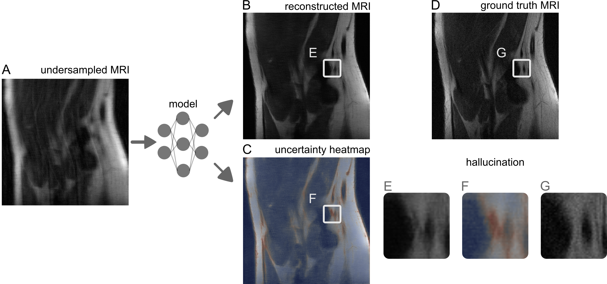

# im2im-uq
A platform for image-to-image regression with rigorous, distribution-free uncertainty quantification.

<div align="center">

</div>

## Summary
This repository provides a convenient way to train deep-learning models in PyTorch for image-to-image regression---any task where the input and output are both images---along with rigorous uncertainty quantification.
The uncertainty quantification takes the form of an interval for each pixel which is guaranteed to contain most true pixel values with high-probability no matter the choice of model or the dataset used (it is a _risk-controlling prediction set_). 
The training pipeline is already built to handle more than one GPU and all training/calibration should run automatically.

The basic workflow is

* Define your dataset in ```core/datasets/```.
* Create a folder for your experiment ```experiments/new_experiment```, along with a file ```experiments/new_experiment/config.yml``` defining the model architecture, hyperparameters, and method of uncertainty quantification. You can use ```experiments/fastmri_test/config.yml``` as a template.
* Edit ```core/scripts/router.py``` to point to your data directory.
* From the root folder, run ```wandb sweep experiments/new_experiment/config.yml```, and run the resulting sweep.
* After the sweep is complete, models will be saved in ```experiments/new_experiment/checkpoints```, the metrics will be printed to the terminal, and outputs will be in ```experiments/new_experiment/output/```.  See ```experiments/fastmri_test/plot.py``` for an example of how to make plots from the raw outputs.

Following this procedure will train one or more models (depending on ```config.yml```) that perform image-to-image regression with rigorous uncertainty quantification.

There are two pre-baked examples that you can run on your own after downloading the open-source data: ```experiments/fastmri_test/config.yml``` and ```experiments/temca_test/config.yml```.
The third pre-baked example, ```experiments/bsbcm_test/config.yml```, reiles on data collected at Berkeley that has not yet been publicly released (but will be soon).

## Paper 
[Image-to-Image Regression with Distribution-Free Uncertainty Quantification and Applications in Imaging](https://arxiv.org/abs/????.?????)
```
@article{angelopoulos2022image,
  title={Image-to-Image Regression with Distribution-Free Uncertainty Quantification and Applications in Imaging},
  author={Angelopoulos, Anastasios N and Kohli, Amit P and Bates, Stephen and Jordan, Michael I and Malik, Jitendra and Alshaabi, Thayer and Upadhyayula, Srigokul and Romano, Yaniv},
  journal={arXiv preprint arXiv:????.?????},
  year={2022}
}
```

## Installation
You will need to execute
```
conda env create -f environment.yml
conda activate microcv
```
You will also need to go through the Weights and Biases setup process that initiates when you run your first sweep.

## Reproducing the results

### FastMRI dataset
* Download the [FastMRI](https://fastmri.med.nyu.edu/) dataset to your machine and unzip it. We worked with the ```knee_singlecoil_train``` dataset.
* Edit [Line 71 of ```core/scripts/router```](https://github.com/aangelopoulos/im2im-uq/blob/9e1b71378636e842b0a9e8c7b87635762422b86c/core/scripts/router.py#L71) to point to the your local dataset.
* From the root folder, run ```wandb sweep experiments/fastmri_test/config.yml```
* After the run is complete, run ```cd experiments/fastmri_test/plot.py``` to plot the results.

### TEMCA2 dataset
* Download the [TEMCA2](https://temca2data.org/download.html) dataset to your machine and unzip it. We worked with sections 3501 through 3839.
* Edit [Line 78 of ```core/scripts/router```](https://github.com/aangelopoulos/im2im-uq/blob/9e1b71378636e842b0a9e8c7b87635762422b86c/core/scripts/router.py#L78) to point to the your local dataset.
* From the root folder, run ```wandb sweep experiments/temca_test/config.yml```
* After the run is complete, run ```cd experiments/temca_test/plot.py``` to plot the results.

## Adding a new experiment
If you want to extend this code to a new experiment, you will need to write some code compatible with our infrastructure. If adding a new dataset, you will need to write a valid PyTorch dataset object; you need to add a new model architecture, you will need to specify it; and so on.
Usually, you will want to start by creating a folder ```experiments/new_experiment``` along with a config file ```experiments/new_experiment/config.yml```. 
The easiest way is to start from an existing config, like ```experiments/fastmri_test/config.yml```.

## Adding new datasets
To add a new dataset, use the following procedure.
* Download the dataset to your machine.
* In ```core/datasets```, make a new folder for your dataset ```core/datasets/new_dataset```.
* Make a valid [PyTorch ```Dataset```](https://pytorch.org/tutorials/beginner/data_loading_tutorial.html) class for your new dataset. The most critical part is writing a ```__get_item__``` method that returns an image-image pair in CxHxW order; see ```core/datasets/bsbcm/BSBCMDataset.py``` for a simple example.
* Make a file ```core/datasets/new_dataset/__init__.py``` and export your dataset by adding the line ```from .NewDataset.py import NewDatasetClass``` (substituting in your filename and classname appropriately).
* Edit ```core/scripts/router.py``` to load your new dataset, near [Line 64](https://github.com/aangelopoulos/im2im-uq/blob/9e1b71378636e842b0a9e8c7b87635762422b86c/core/scripts/router.py#L64), following the pattern therein. You will also need to import your dataset object.
* Populate your new config file ```experiments/new_experiment/config.yml``` with the correct directories and experiment name.
* Execute ```wandb sweep experiments/new_experiment/config.yml``` and proceed as normal!

## Adding new models
In our system, there are two parts to a model---the base architecture, which we call a ```trunk``` (e.g. a U-Net), and the final layer.
Defining a trunk is as simple as writing a regular PyTorch ```nn.module``` and adding it near [Line 87 of ```core/scripts/router.py```](https://github.com/aangelopoulos/im2im-uq/blob/1f7965e169a790548b2b8db69fa005b7ecbfc40d/core/scripts/router.py#L87) (you will also need to import it); see [```core/models/trunks/unet.py```](https://github.com/aangelopoulos/im2im-uq/blob/53a80bd914ee32741d795e451be7449836f8629e/core/models/trunks/unet.py#L10) for an example.

The process for adding a final layer is a bit more involved.
The final layer is simply a Pytorch ```nn.module```, but it also must come with two functions: a loss function and a nested prediction set function.
See ```core/models/finallayers/quantile_layer.py``` for an example.
The steps are:
* Create a final layer ```nn.module``` object. The final layer should also have a heuristic notion of uncertainty built in, like quantile outputs.
* Specify the loss function is used to train a network with this final layer.
* Specify a nested prediction set function that uses output of the final layer to form a prediction set. The prediction set should scale up and down with a free factor ```lam```, which will later be calibrated. The function should have the same prototype as that on [Line 34 of ```core/models/finallayers/quantile_layer.py```](https://github.com/aangelopoulos/im2im-uq/blob/d42ac0aeeb5c01a853de5b64f26818b8a055dfde/core/models/finallayers/quantile_layer.py#L34) for an example.  
* After creating the new final layer and related functions, add it to ```core/models/add_uncertainty.py``` as in [Line 59](https://github.com/aangelopoulos/im2im-uq/blob/d42ac0aeeb5c01a853de5b64f26818b8a055dfde/core/models/add_uncertainty.py#L55).
* Edit ```wandb sweep experiments/new_experiment/config.yml``` to include your new final layer, and run the sweep as normal!
